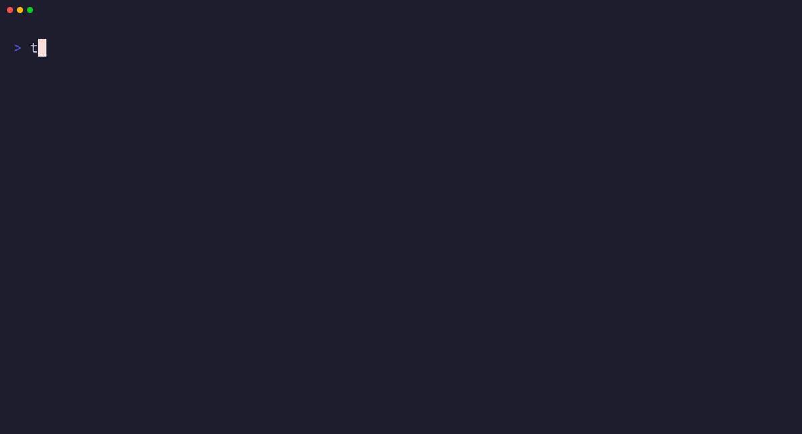

TS# tars

[](https://github.com/cloudwalksolutions/machine-setup/actions/workflows/release.yml)
[](https://github.com/cloudwalksolutions/machine-setup/releases/latest)

[](cli/go.mod)
[](LICENSE)

Provision a development machine — dotfiles, dev tools, fonts, terminal, byobu
sessions, git identities — from a single binary, with a versioned backup of
everything it replaces.


*`tars pull --dry-run` previews every write, `tars pull` applies them, and a second
dry run finds nothing left to do.*

## Why tars

- **One binary, no clone.** The Neovim, Zsh, Byobu and Vim configs are embedded;
  with a clone present, tars prefers it.
- **Nothing is lost.** Every file it replaces is archived first, per user, and never
  auto-deleted. `--dry-run` shows the plan before anything is written.
- **Idempotent and offline.** `pull` touches only files that differ, needs no network,
  and exits non-zero if any component fails.
- **macOS and Linux**, including shared bastions: read-only clones, per-user
  backups, unattended mode.

## Install

```bash
# Homebrew (macOS)
brew install --cask cloudwalksolutions/tap/tars

# Native installer (Linux servers, or anywhere without brew) — installs to ~/.local/bin
curl -fsSL https://raw.githubusercontent.com/cloudwalksolutions/machine-setup/main/install.sh | sh

# From source
git clone https://github.com/cloudwalksolutions/machine-setup.git && cd machine-setup/cli && go build -o tars .
```

The installer verifies the release checksum; override the directory with
`TARS_INSTALL_DIR` and make sure it is on your `PATH`. Check with `tars --version`.

## Getting started

1. **Bootstrap the machine.**
   ```bash
   tars setup                 # interactive; or: TARS_NO_FORM=1 tars setup  (installs everything)
   ```
   You get a tool checklist (Enter accepts all), brew or apt installs, oh-my-zsh and
   Powerlevel10k, then one line per config component. macOS asks for your password
   once, to copy fonts into `/Library/Fonts`. A failed component is listed and setup
   continues; fix the cause and run `tars pull`.
2. **Start a new shell** so the configs load.
   ```bash
   exec zsh
   ```
   Put API keys in `~/.zshrc_secret` and per-machine `PATH` entries in
   `~/.zprofile_local`. Both were seeded for you and are never overwritten.
3. **Confirm nothing is pending.**
   ```bash
   tars pull --dry-run        # every line reads "unchanged"
   ```
4. Optional: [byobu sessions](#sessions) and [git profiles](#profiles).

## Commands

| Command | Alias | What it does |
|---|---|---|
| `tars setup` | | Full bootstrap: pick tools, install them, install oh-my-zsh + Powerlevel10k, apply all configs |
| `tars pull` | | Apply configs only: no installs, no network. `--dry-run` previews |
| `tars push` | | Capture local config edits back into a repo clone |
| `tars sessions` | `s`, `by` | Open byobu sessions from a simple config |
| `tars profiles` | `p` | Switch git, GitHub and SSH identity per project dir |
| `tars claude init` | `c i` | Pick and apply Claude Code pieces: edit-blocking hook, settings, global rules |
| `tars claude project [dir]` | `c p` | Scaffold a project `CLAUDE.md` from the repo template (`--force` to replace) |
| `tars pi init` | `pi i` | Set up the pi coding agent: packages, model providers (ollama / llama.cpp / any OpenAI-compatible), baseline agent |

`tars --version` prints the build; `--config <file>` overrides the tool-selection
config. `pull` and `push` exit non-zero when any component fails; `setup` tolerates
config failures so a partial bootstrap stays recoverable.

## What it changes

Every file below is archived to `~/.local/state/tars/backups/<component>/vN`
(override with `TARS_BACKUP_ROOT`) before it is replaced:

- `~/.zshrc`, `~/.zshrc_aliases`, and the login profile (`~/.zprofile` on macOS, `~/.profile` on Linux)
- `~/.config/nvim/` (replaced wholesale), `~/.vimrc`, `~/.vim/colors/`
- `~/.byobu/` configs and status scripts
- Hack Nerd Font into `/Library/Fonts` (macOS, sudo) or `~/.local/share/fonts` (Linux)
- macOS only: the iTerm2 and Terminal.app font and profile
- With profiles configured: the managed block in `~/.gitconfig` and `~/.config/tars/profiles/<alias>.gitconfig`
- `~/.claude/`: the `block-unreviewable-edits.sh` hook, a `CLAUDE.md` rendered from
  `claude/rules/`, and a merge of `claude/settings.json` into `settings.json`.
  Machine-local keys such as `autoMode` and `permissions` are left alone; `~/.claude.json`
  is never touched

Never overwritten, seeded once when absent: `~/.zshrc_secret`, `~/.zprofile_local`,
`~/.config/tars/profiles/<alias>.env`. `~/.zshrc_funcs` is yours entirely.

## Sessions

Declare byobu sessions once instead of rebuilding windows after every restart.
`tars s e` seeds the file and opens it:

```yaml
# ~/.config/tars/sessions.yaml (example)
sessions:
  - name: cloudwalk        # no '.' or ':' in names; at least one dir
    dirs:
      - ~/work/api         # one window per dir
      - ~/work/infra
```


| Command | Does |
|---|---|
| `tars s` | interactive picker |
| `tars s a` | open every session, attach to the first |
| `tars s o <name>` | open one (create-or-attach, idempotent) |
| `tars s n [name]` | fresh session rooted at `~` (a name is required inside tmux) |
| `tars s l` / `tars s e` | list / edit the config |

Inside byobu it switches sessions instead of nesting.

## Profiles

One machine, several accounts. A profile is a name, an alias, an email and a GitHub
user. It owns `<projects_dir>/<name>` and signs with `~/.ssh/id_rsa.<alias>`.

```yaml
# ~/.config/tars/profiles.yaml
projects_dir: ~/Desktop/projects   # optional, this is the default
full_name: Your Name               # required; a profile may set its own
profiles:
  - name: cloudwalk                # owns ~/Desktop/projects/cloudwalk
    alias: cws                     # signs with ~/.ssh/id_rsa.cws
    email: you@cloudwalk.example
    github: your-github-user
```



`tars pull`, `tars p apply`, and every `use`, `add` and `edit` render:

| File | Purpose |
|---|---|
| `~/.config/tars/profiles/<alias>.gitconfig` | `user.name`, `user.email`, `core.sshCommand -i <key>`, `github.user` |
| `~/.gitconfig`, managed `# BEGIN/END tars profiles` block only | `includeIf gitdir:<dir>/` per profile; a plain `include` for the active one |
| `~/.config/tars/profiles/<alias>.env` | seeded once, then yours: exports `TARS_PROFILE` and `GITHUB_USER`; put `GITHUB_TOKEN` and per-account aliases here. `~/.zshrc` sources the active one |
| `~/.config/tars/profiles/active` | the alias `use` chose |

Nothing else in `~/.gitconfig` is touched, and it is backed up before every change.
Keys are never generated or copied; a missing key is reported as a warning.

| Command | Does |
|---|---|
| `tars p` | interactive picker → `use` |
| `tars p use <alias\|name>` | default identity outside any profile dir; runs `gh auth switch --user` |
| `tars p list` / `tars p show [alias\|name]` | list (active marked `*`) / one profile's derived paths (default: the active one) |
| `tars p add` / `tars p edit` / `tars p apply` | add interactively / edit the yaml, then re-render / re-render only |

### Walkthrough

For each account (example: name `cloudwalk`, alias `cws`):

1. Have an SSH key named for the alias, with its public half on that GitHub account:
   ```bash
   ssh-keygen -t ed25519 -f ~/.ssh/id_rsa.cws -C you@cloudwalk.example   # the file name must be id_rsa.<alias>
   ```
2. Log `gh` into that account once (repeat per account; `gh auth status` lists them):
   ```bash
   gh auth login
   ```
3. Declare the profile. Saving renders the files above; a missing key prints
   `profiles: cws has no key at ~/.ssh/id_rsa.cws`.
   ```bash
   tars p e                   # seeds ~/.config/tars/profiles.yaml and opens $EDITOR
   ```
4. Keep that account's repos under its dir. The directory is what selects the identity.
   ```bash
   mkdir -p ~/Desktop/projects/cloudwalk && cd ~/Desktop/projects/cloudwalk && git clone ...
   ```
5. Pick the default for everything outside a profile dir:
   ```bash
   tars p use cws
   ```
   If it prints `GITHUB_TOKEN is exported`, move that export from `~/.zshrc_secret`
   into `~/.config/tars/profiles/cws.env` and open a new shell.
6. Verify:
   ```bash
   exec zsh && tars p list                                  # active marked *
   git -C ~/Desktop/projects/cloudwalk/<repo> config user.email   # you@cloudwalk.example
   gh auth status                                           # active: your-github-user
   ```

## Claude Code

`tars claude init` asks three things in a form: install the hook that denies
`sed -i` / heredoc / interpreter writes (so every change is a reviewable Edit or
Write), merge the shared settings fragment, and which global rules to render
into `~/.claude/CLAUDE.md`. Choices are saved under `claude:` in the tars config
and honored by every later `tars pull`; `tars push` carries hook edits and the
shareable settings keys back into the repo. Add a rule by dropping a short
`NN-slug.md` into `claude/rules/` and running `make sync-assets`.

`tars claude project [dir]` writes a starter `CLAUDE.md` (overview, philosophy,
constraints, commands, architecture, testing, secrets, gotchas) from
`claude/templates/CLAUDE.project.md`, asking for the name, a one-line
description and the canonical test command.

## Environment variables

| Variable | Effect |
|---|---|
| `TARS_REPO` | Use this clone as the config source (beats discovery) |
| `TARS_NO_FORM` | Skip all TUIs: `setup` selects everything, pickers take the first entry. `p add` is interactive only |
| `TARS_BACKUP_ROOT` | Backup location (default `~/.local/state/tars/backups`) |
| `TARS_CONFIG_PATH` | Tool-selection config (default `~/.config/tars/config.yaml`) |
| `TARS_SESSIONS_PATH` | Sessions file (default `~/.config/tars/sessions.yaml`) |
| `TARS_PROFILES_PATH` | Profiles file (default `~/.config/tars/profiles.yaml`) |
| `TARS_INSTALL_DIR` | Where `install.sh` puts the binary |

The active profile's env file additionally exports `TARS_PROFILE` and `GITHUB_USER`.

## Development

The CLI is Go (module in `cli/`), tested with Ginkgo/Gomega and strict TDD; see
[CLAUDE.md](CLAUDE.md). Targets: `make check` (lint + build + tests), `make unit`,
`make e2e` (Docker: three users, a root-owned read-only clone, a no-clone install),
`make demos` (re-record the GIFs; `vhs/bin/gh` stands in for gh). After editing any
dotfile under `nvim/ zsh/ byobu/ vim/ fonts/ terminal/ claude/`, run `make sync-assets`
or the drift guard fails CI. Every PR runs the race-enabled unit suite on Ubuntu and
macOS, golangci-lint with gofmt, a `go mod tidy` check, the coverage gate, the Docker
e2e on amd64 and arm64, the Neovim smoke tests, and `goreleaser check`. Every merge to
`main` then releases a new patch version: [docs/releasing.md](docs/releasing.md).

## Known limitations

- The Linux package list is thinner than macOS's (no eza/lazygit/k9s/terraform yet)
- Neovim on Linux installs a pinned upstream tarball (v0.11.6) without checksum pinning
- `tars push` writes into the clone it finds; keep shared clones read-only

## License

[Apache-2.0](LICENSE)
